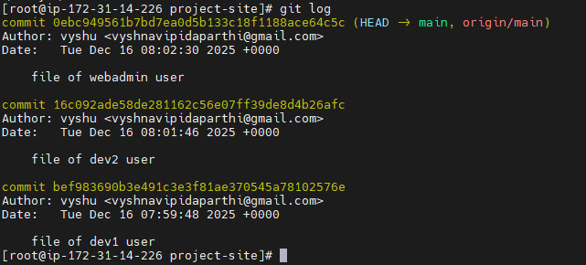

# Multi-User Linux Web Server with Git Version Control

## Project Overview

This project demonstrates real-world Linux system administration practices by deploying a multi-user web server on AWS EC2 and managing the application code using Git and GitHub. The focus is on user/group management, permission control, and collaborative version control—skills expected from entry-level Linux/DevOps engineers.


## Technology Stack

* **Operating System:** Amazon Linux 2 (EC2 Free Tier)
* **Web Server:** Apache (httpd)
* **Version Control:** Git, GitHub
* **Cloud Platform:** AWS EC2


## Project Architecture

```
Users (dev1, dev2, webadmin)
        ↓
Linux Group: webteam
        ↓
Shared Directory: /var/www/project-site
        ↓
Apache VirtualHost (Port 80)
        ↓
Public Access via EC2 Public IP
```


## User and Group Configuration

* Created three Linux users:

  * `dev1`
  * `dev2`
  * `webadmin`
* Created a Linux group: `webteam`
* Added all users to the `webteam` group
* Set group ownership and permissions on the project directory

```bash
sudo chown -R webadmin:webteam /var/www/project-site
sudo chmod -R 2775 /var/www/project-site
```

This ensured controlled collaborative access using Linux permissions and the setgid bit.


## Web Server Configuration

* Installed Apache (`httpd`)
* Configured a custom VirtualHost to serve the project directory:

```apache
<VirtualHost *:80>
    DocumentRoot /var/www/project-site
    <Directory /var/www/project-site>
        AllowOverride All
        Require all granted
    </Directory>
</VirtualHost>
```

* Disabled the default Apache welcome page (`welcome.conf`)
* Validated configuration using `apachectl configtest`


## Application Structure

```
/var/www/project-site/
│── screenshots
│── index.html     (webadmin)
│── dev1.html      (dev1)
│── dev2.html      (dev2)
│── .git/
```

Each user created and managed their own HTML page.


## Git and GitHub Workflow

* Initialized a single Git repository in `/var/www/project-site`
* Each Linux user committed changes under their own account
* Pushed the repository to GitHub
* Commit history reflects multi-user collaboration

## Application Screenshots

### Landing Page (Deployed on Apache)
.png)

### HTTP Status and Apache Response


### Git Commit History (Multi-User Collaboration)


### Localhost Validation


## Validation and Testing

* Verified Apache service and port 80 listening
* Tested locally using:

```bash
curl http://localhost
```

* Verified public access via:

```
http://<EC2_PUBLIC_IP>
```


## Key Learnings

* Linux user and group management in shared environments
* Permission control using ownership, groups, and setgid
* Apache VirtualHost configuration on Amazon Linux
* Git-based collaboration using a shared codebase
* Understanding separation of OS-level users and GitHub version control


## Reproducibility

Although the EC2 instance was terminated after validation, the entire setup is fully reproducible using the documented steps and configuration files in this repository.

